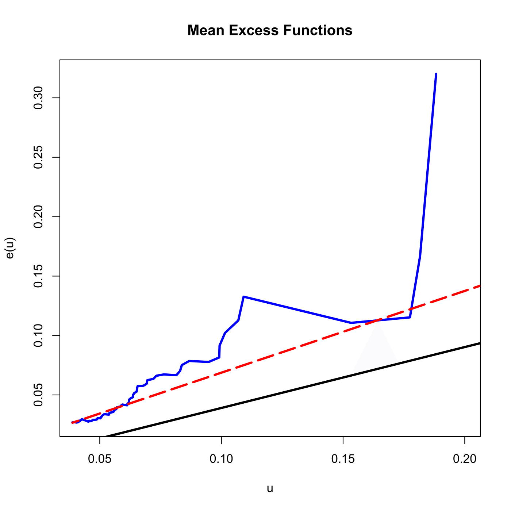

[](http://quantlet.de/index.php?p=info)

## [](http://quantlet.de/) **SFEMeanExcessFun** [](http://quantlet.de/d3/ia)

```yaml

Name of QuantLet : SFEMeanExcessFun

Published in : Statistics of Financial Markets

Description : 'Plots the empirical mean excess function, the mean excess function of generalized
Pareto distribution, the mean excess function of Pareto distribution with parameter estimated with
Hill estimator for the negative log-returns of portfolio (Bayer, BMW, Siemens, VW) for the time
period from 2000-01-01 to 2012-12-31.'

Keywords : 'asset, data visualization, dax, financial, graphical representation, plot, portfolio,
returns, log-returns, stock-price, pareto, generalized-pareto-model, MEF, hill-estimator'

See also : 'SFEportfolio, SFEportlogreturns, SFEdenport, SFEclose, SFEtailGEV_pp, SFEtailGEV_qq,
SFEtailGPareto_pp, SFEtailGPareto_qq, SFEgpdist'

Author : Barbara Choros-Tomczyk, Awdesch Melzer

Submitted : Fri, November 29 2013 by Awdesch Melzer

Datafiles : BAYER_close_0012.dat, BMW_close_0012.dat, SIEMENS_close_0012.dat, VW_close_0012.dat

```




```r

# clear variables and close windows
rm(list = ls(all = TRUE))
graphics.off()

# load data
a = read.table("BAYER_close_0012.dat")
b = read.table("BMW_close_0012.dat")
c = read.table("SIEMENS_close_0012.dat")
d = read.table("VW_close_0012.dat")

e = a + b + c + d
e = as.matrix(e)
end = NROW(e)
x = log(e[1:(end - 1)]) - log(e[2:end])  # negative log-returns
n = length(x)
x = sort(x, decreasing = TRUE)
m = 100
x1 = x[1:m]

# empirical mean excess function
t = x[1:(m + 1)]  # t must be >0
MEF = numeric()

for (i in 1:length(t)) {
    y = x[which(x > t[i])]
    MEF[i] = mean(y - t[i])
}

# plot
plot(t, MEF, type = "l", col = "blue", lwd = 3, xlab = "u", ylab = "e(u)", xlim = c(0.04, 
    0.2))
title("Mean Excess Functions")

# mean excess function of generalized Pareto distribution
k = 100
GPD = gpdFit(x, type = "mle", information = "observed")
K = attr(GPD, "fit")$par.ests[1]
sigma = attr(GPD, "fit")$par.ests[2]
gpme = (sigma + K * (t - mean(t)))/(1 - K)
lines(t, gpme, lwd = 3)

# Hill estimator, mean excess function of Pareto distribution
alphaH = (mean(log(x1)) - log(x1[k]))^(-1)
sigmaH = x1[k] * (k/n)^(1/alphaH)
gp1me = t/(alphaH - 1)
lines(t, gp1me, col = "red", lwd = 3, lty = 5)
```
