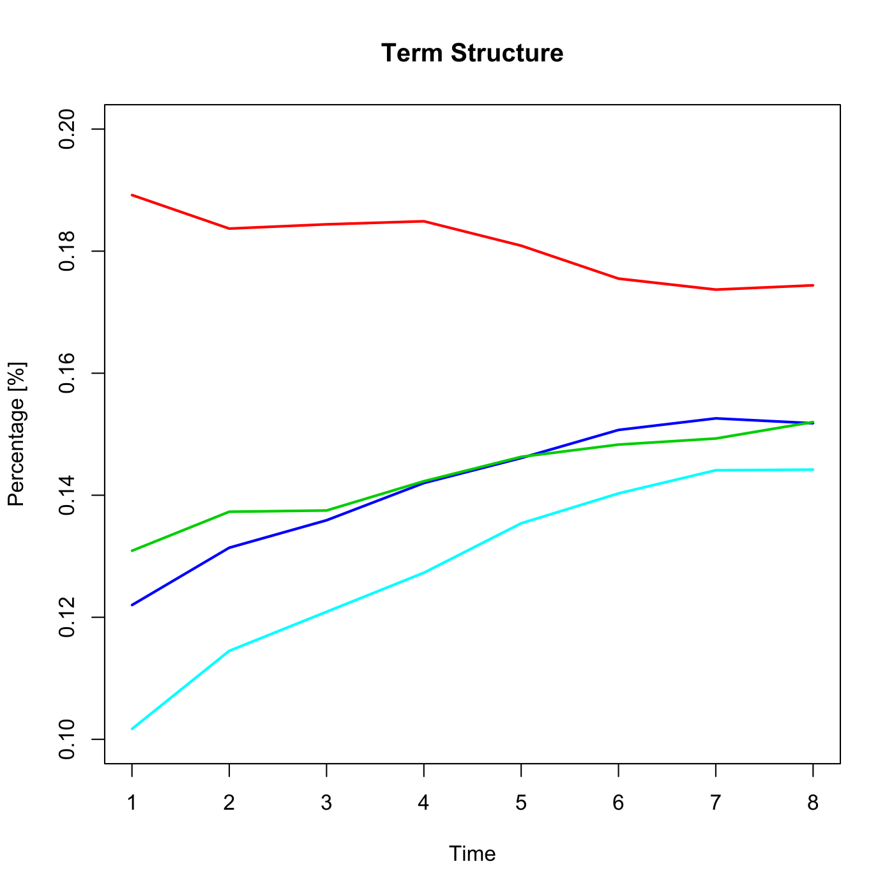

[](http://quantlet.de/index.php?p=info)

## [](http://quantlet.de/) **SFEVolaTermStructure** [](http://quantlet.de/d3/ia)

```yaml

Name of QuantLet : SFEVolaTermStructure

Published in : Statistics of Financial Markets

Description : 'Shows an intersection of the implied volatility surface, illustrates time to
maturity structure of implied DAX volatilities at the money.'

Keywords : 'atm, black-scholes, dax, financial, implied-volatility, index, option, surface, term
structure, vdax, volatility'

See also : SFEVolSurfPlot, SFEVolSurfPlot, SFEVolaCov, SFEVolaPCA

Author : Joanna Tomanek

Submitted : Fri, June 05 2015 by Lukas Borke

Datafiles : implvola.dat

Example : Time to maturity structure of implied DAX volatilities at the money.

```




```r

# clear variables and close windows
rm(list = ls(all = TRUE))
graphics.off()

# load data
x = read.table("implvola.dat")

# rescale
x = x/100

dat1 = cbind(c(1:8), t(x[11, ]))
dat2 = cbind(c(1:8), t(x[31, ]))
dat3 = cbind(c(1:8), t(x[111, ]))
dat4 = cbind(c(1:8), t(x[231, ]))

a = seq(0.12, to = 0.19, length.out = 8)
plot(a, type = "n", main = "Term Structure", xlab = "Time", ylab = "Percentage [%]", ylim = c(0.1, 0.2))
lines(dat1, col = 4, type = "l", lwd = 2)
lines(dat2, col = 3, type = "l", lwd = 2)
lines(dat3, col = 5, type = "l", lwd = 2)
lines(dat4, col = 2, type = "l", lwd = 2) 

```
