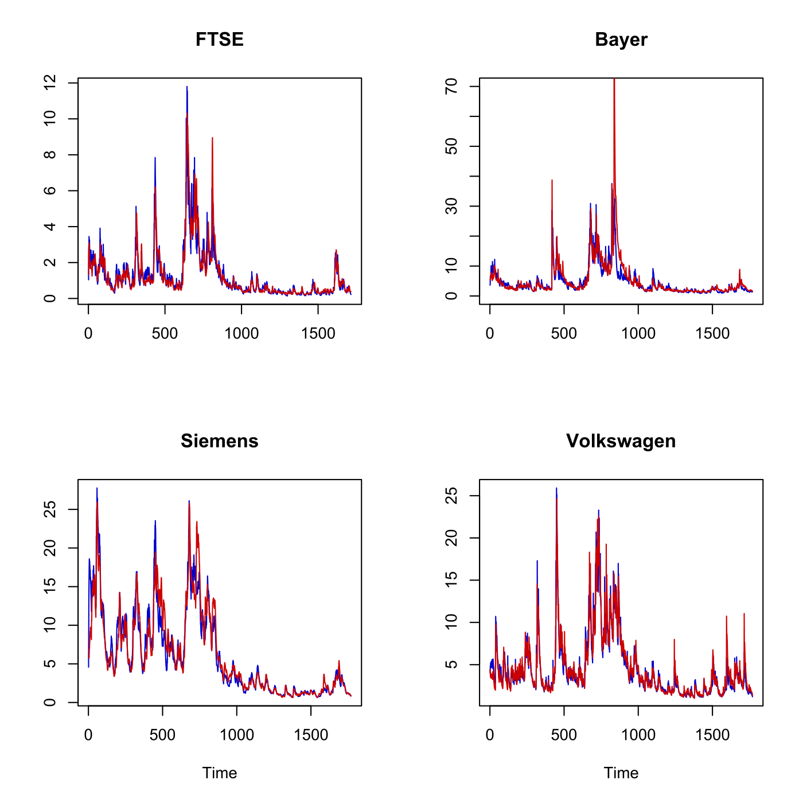

[](http://quantlet.de/index.php?p=info)

## [](http://quantlet.de/) **SFECondVola** [](http://quantlet.de/d3/ia)

```yaml

Name of QuantLet : SFECondVola

Published in : Statistics of Financial Markets

Description : 'Plots conditional volatility forecasts for log-returns of FTSE and DAX stocks
(Bayer, Siemens and Volkswagen) based on the Fractional Integrated Asymmetric Power ARCH (FIAPARCH,
blue) model and the Hyperbolic-GARCH (HYGARCH, red) model.'

Keywords : 'arch, asset, data visualization, dax, descriptive-statistics, financial, forecast,
ftse100, garch, graphical representation, index, log-returns, plot, process, returns, simulation,
stochastic, stochastic-process, stock-price, time-series, volatility'

Author : Julius Mungo, Awdesch Melzer

Submitted : Thu, July 16 2015 by quantomas

Datafiles : 'ConVola(FIAPARCH)bayer.txt, ConVola(FIAPARCH)ftse.txt, ConVola(FIAPARCH)siemens.txt,
ConVola(FIAPARCH)vw.txt, ConVola(HYGARCH)bayer.txt, ConVola(HYGARCH)ftse.txt,
ConVola(HYGARCH)siemens.txt, ConVola(HYGARCH)vw.txt'

```




```r
# clear variables and close windows
rm(list = ls(all = TRUE))
graphics.off()

# FTSE 
x = read.table("ConVola(FIAPARCH)ftse.txt")
n = length(as.matrix(x))
par(mfrow = c(2, 2))
plot(as.matrix(x), type = "l", ylab = "", xlab = "", col = "blue3")
title("FTSE")
x1 = read.table("ConVola(HYGARCH)ftse.txt")
lines(as.matrix(x1), col = "red3")

# Bayer
x = read.table("ConVola(FIAPARCH)bayer.txt")
n = length(as.matrix(x))
plot(as.matrix(x), type = "l", ylab = "", xlab = "", col = "blue3", ylim = c(0, 
    70))
title("Bayer")
x1 = read.table("ConVola(HYGARCH)bayer.txt")
x1 = as.matrix(x1)
lines(x1, col = "red3")

# Siemens
x = read.table("ConVola(FIAPARCH)siemens.txt")
x = as.matrix(x)
plot(x, type = "l", ylab = "", xlab = "Time", col = "blue3")
n = length(x)
title("Siemens")
x1 = read.table("ConVola(HYGARCH)siemens.txt")
x1 = as.matrix(x1)
lines(x1, col = "red3")

# VW
x = read.table("ConVola(FIAPARCH)vw.txt")
x = as.matrix(x)
plot(x, type = "l", ylab = "", xlab = "Time", col = "blue3")
n = length(x)
title("Volkswagen")
x1 = read.table("ConVola(HYGARCH)VW.txt")
lines(x1, col = "red3") 
```
