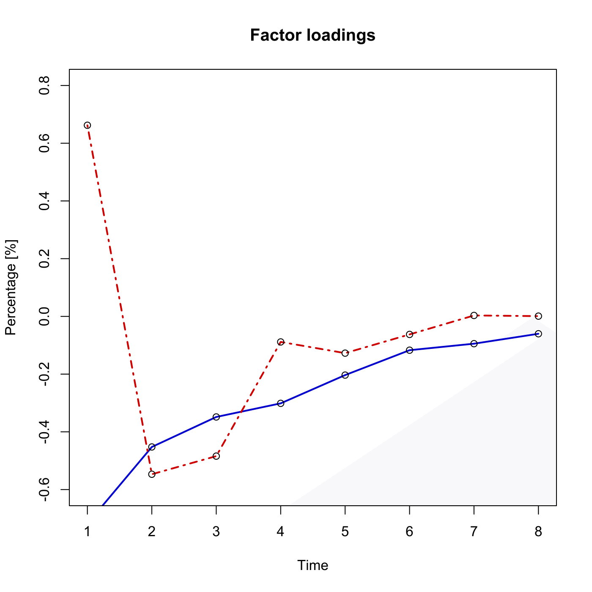

[](http://quantlet.de/index.php?p=info)

## [](http://quantlet.de/) **SFEPCA** [](http://quantlet.de/d3/ia)

```yaml

Name of QuantLet : SFEPCA

Published in : Statistics of Financial Markets

Description : 'Calculates and plots the factor loadings of the first and second principal
components of implied DAX volatilities at the money.'

Keywords : 'atm, black-scholes, data visualization, dax, factor-loadings, financial, graphical
representation, implied-volatility, index, option, pca, plot, principal-component-analysis,
principal-components, vdax, volatility'

See also : SFEVolSurfPlot

Author : Juliane Scheffel, Mathias Fengler

Submitted : Sat, July 18 2015 by quantomas

Datafiles : implvola.dat

```




```r
# clear variables and close windows
rm(list = ls(all = TRUE))
graphics.off()

# load data
x = read.table("implvola.dat")

# rescale
x = x/100

# number of rows
n = nrow(x)

# compute first differences
z = apply(x,2,diff)
# calculate covariance
s = cov(z) * 1e+05

# determine eigenvectors
e = eigen(s)
e = e$vectors

f1 = e[, 1]
f2 = e[, 2]

# Adjust second Eigenvector in R not necessary - the computation differs from R to Matlab 

# Plot
plot(f1, col = "blue3", ylim = c(-0.6, 0.8), lwd = 2, type = "l", xlab = "Time", 
    ylab = "Percentage [%]", main = "Factor loadings")
points(f1)
lines(f2, col = "red3", lwd = 2, lty = "dotdash")
points(f2) 
```
