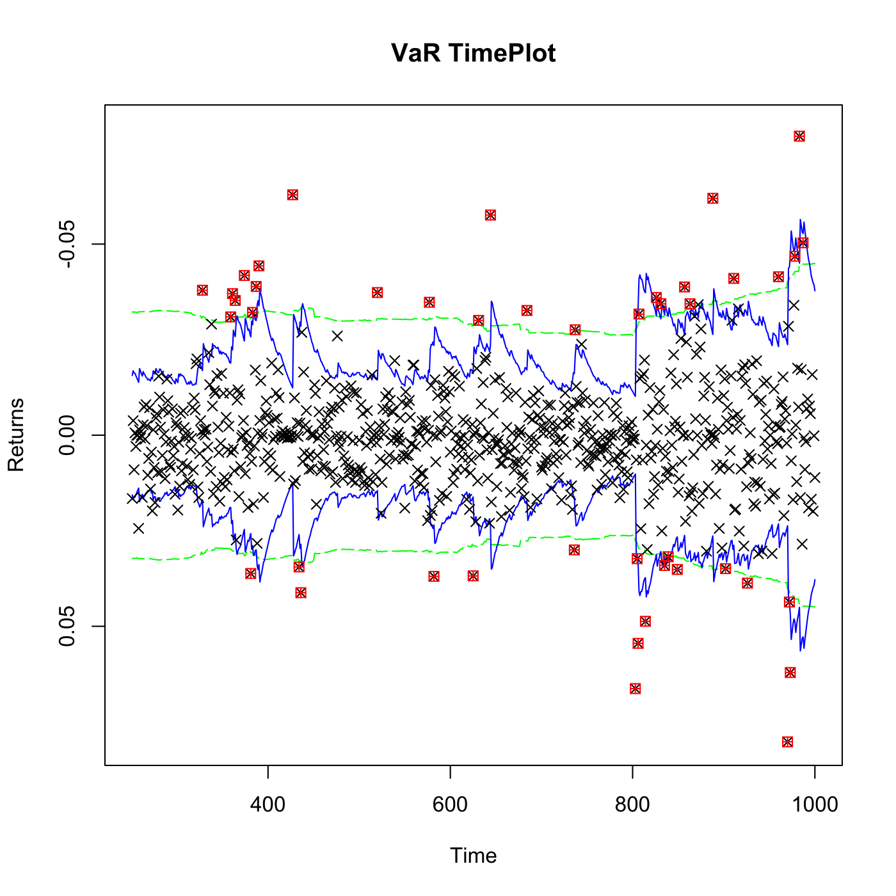

[](http://quantlet.de/index.php?p=info)

## [](http://quantlet.de/) **SFEVaRtimeplot** [](http://quantlet.de/d3/ia)

```yaml

Name of QuantLet : SFEVaRtimeplot

Published in : Statistics of Financial Markets

Description : 'Shows the time plot of the Value at Risk (VaR) forecasts and the associated changes
of the Profit & Loss (P&L) of the portfolio for Rectangular Moving Average (RMA) and Exponentially
Moving Average (EMA) models.'

Keywords : 'VaR, bond, data visualization, ema, estimation, exceedance, financial, forecast,
graphical representation, moving-average, multivariate normal, normal-distribution, plot,
portfolio, risk, rma, time-series'

See also : SFEVaRbank, SFEVaRqqplot, SFEVaRtimeplot2, VaRest, VaRqqplot

Author : Wolfgang K. Härdle

Submitted : Wed, July 22 2015 by quantomas

Datafiles : kupfer.dat

```




```r
# clear variables and close windows
rm(list = ls(all = TRUE))
graphics.off()

VaRest = function(y, method) {
    # parameter settings
    n     = length(y)
    h     = 250
    lam   = 0.96
    dist  = 0
    alpha = 0.01
    w     = 1
    bw    = 0
    
    # RMA
    if (method == 1) {
        sigh = matrix(1, (n - h), (n - h)) - 1
        tmp  = cumsum(y * y)
        tmp1 = (tmp[(h + 1):n] - tmp[1:(n - h)])/h
        sigh = sqrt(((w * tmp1) * w))
    }
    grid = seq(h - 1, 0)
    
     # EMA
    if (method == 2) {
        sigh = matrix(1, (n - h), 1) - 1
        j    = h
        while (j < n) {
            j           = j + 1
            tmp         = (lam^grid) * y[(j - h):(j - 1)]
            tmp1        = sum(tmp * tmp)
            sigh[j - h] = sqrt(sum((tmp1)) * (1 - lam))
        }
    }
    if (dist == 0) {
        qf = qnorm(alpha, 0, 1)
    } else {
        sigh = sigh/sqrt(dist/(dist - 2))
        qf   = qt(alpha, dist)
    }
    VaR = qf * sigh
    VaR = cbind(VaR, (-VaR))
}

# Main computation
x1 = read.table("kupfer.dat")
x  = x1[1:1001, 1]
y  = diff(log(x))
h  = 250

# Option 1=RMA, Option 2=EMA
opt1 = VaRest(y, 1)
opt2 = VaRest(y, 2)

# Plots
plotx = seq(h + 1, length(x) - 1)
plot(plotx, opt1[, 1], col = "green", type = "l", lty = "longdash", ylim = c(0.08, 
    -0.08), main = "VaR TimePlot", xlab = "Time", ylab = "Returns")
lines(plotx, opt1[, 2], col = "green", lty = "longdash")
lines(plotx, opt2[, 1], col = "blue", lty = "solid")
lines(plotx, opt2[, 2], col = "blue", lty = "solid")

k = seq(1, length(x) - 1)
points(k[251:(length(x) - 1)], y[251:(length(x) - 1)], col = "black", pch = 4)
exceed = matrix(0, length(seq(251, length(y))))
l = 1
for (i in 251:length(y)) {
    if ((opt1[i - 250, 2] < y[i]) || (y[i] < opt1[i - 250, 1])) {
        exceed[l] = y[i]
        points(i, exceed[l], col = "red", pch = 12)
        l = l + 1
    }
} 
```
