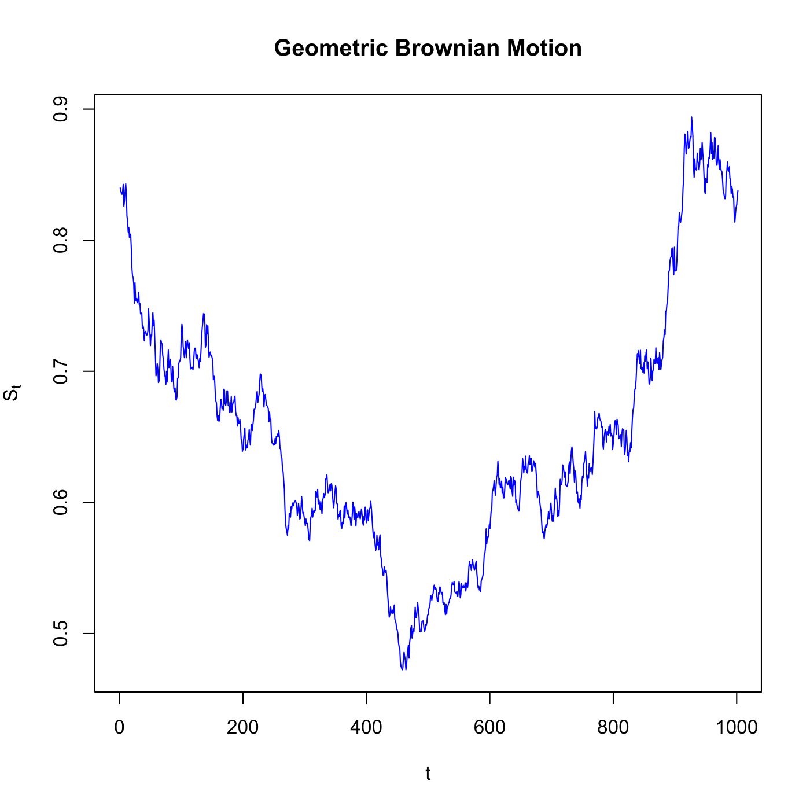

[](http://quantlet.de/index.php?p=info)

## [](http://quantlet.de/) **SFEGBMProcess** [](http://quantlet.de/d3/ia)

```yaml

Name of QuantLet : SFEGBMProcess

Published in : Statistics of Financial Markets

Description : 'Simulation of discrete observations of a Geometric Brownian Motion (GBM) via direct
integration (method=1) or Euler scheme (method=2). The process follows the stochastic differential
equation: dX(t) = mu X(t) dt + sigma X(t) dW(t).'

Keywords : 'Euler, brownian-motion, direct integration, discrete, geometric-brownian-motion,
graphical representation, normal-distribution, plot, process, random-number-generation, simulation,
stochastic, stochastic-process, wiener-process'

See also : SFEsimGBM, SFEbsbm, SFEDeltaHedging, SFEWienerProcess, SFSbb, SFEwienerdens

Author : Alexander Ristig

Submitted : Tue, June 17 2014 by Franziska Schulz

Input: 
- method: type of method used

Example : 'A plot of typical path of a geometric brownian motion is provided for the case n=1,
x0=0.084, mu=0.02, sigma=sqrt(0.1) delta=1/1000.'

```




```r

# clear variables and close windows
rm(list = ls(all = TRUE))
graphics.off()

print("Please input method type as: 1 - Direct Integration, 2 - Euler Scheme")
method = 1  # if you want to apply Euler Scheme take 2 instead of 1

n      = 1
x_0    = 0.84
mu     = 0.02
sigma  = sqrt(0.1)
delta  = 1/1000
t      = c(0:ceiling(n/delta))
dimt   = dim(t(t))
x      = array(1, dim = dimt)
x[1]   = x_0
no     = rnorm((dimt[2] - 1), mean = 0, sd = 1) * sqrt(delta)

if (method == 1) {
    x = x_0 * exp(cumsum((mu - 0.5 * sigma^2) * delta + sigma * no))
}
{
    for (i in 2:dimt[2]) {
        x[i] = x[i - 1] + mu * x[i - 1] * delta + sigma * x[i - 1] * no[i - 1]
    }
}

if (method == 1) {
    x = c(x_0, x)
}
x = c(t(x))

# plot
par(mfrow = c(1, 1))
margins = c(1, 1, 1, 1)
plot(x, type = "l", col = "blue", main = "Geometric Brownian Motion", xlab = "t", 
    ylab = expression(S[t]), xlim = c(0, 1000))

```
